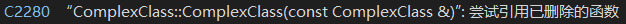

[toc]

# 0. 序言

学习自[C++ Rvalue References Explained (thbecker.net)](http://thbecker.net/articles/rvalue_references/section_01.html)


# 1. 引入

## 1.1 拷贝间接资源

如果一个类的成员变量有**指针**, 例如

```c++
class MyClass{
public:
  T* element;
}
```

有两个MyClass变量a和b, 这时候执行

```c++
a = b;
```

Visual Studio抛出以下错误**尝试调用已经删除的函数xxx**,  仔细看, 发现它是**缺省拷贝函数**



这是因为缺省拷贝函数是**对应成员的简单复制**, 它**无法对间接资源**进行**浅拷贝或是深拷贝**

所以编译器要求你来定义拷贝函数

```c++
class MyClass{
public:
  
  MyClass(MyClass& mc02){
		if (element != nullptr){
      delete element;
      element = nullptr;
    }
    
    // 复制资源, 而不是简单赋值, 如element = mc02.element
    element = new T(mc02.element);
  }
  
  T* element;
}c
```


简单小结: 

> *一般拷贝函数的流程是*
>
> ​	(1) delete origin resource
>
> ​	(2) copy target resource


## 1.2 可以不拷贝的情况

1.1中为什么要拷贝资源, 本质是为了**让两个变量保持独立, 修改其中一个不会影响另一个**, 那什么时候可以不拷贝, 根据前面拷贝资源的理由的, 可以想到**如果只有一个变量, 就不需要拷贝多一份资源, 而用原来的就好**. 看下面代码

```c++
T foo();

T a = foo();
```

等价为

```c++
T foo();

T b = foo();  // 如果你确定变量b除了下面赋值会使用一次, 以后都不会使用. 那么它可以省略.
T a = b;
```

foo函数返回了一个**临时对象T**, a = foo()这条语句执行, 依然是**拷贝了这个临时对象的资源**将它交赋值给a. 显然效率更高的做法是**交换a和临时对象T的资源**, 这样做少了拷贝资源的过程.


简单小结:

>*拷贝临时对象(变量)的一般流程*
>
>​	(1) swap two resource pointer


# 2. 左值和右值

这里的左值右值概念不是准确的(就像文章说的一样), 但是用来理解move语义已经够了.


*定义*

> ​	能在赋值号两边的为左值
>
> ​	只能在赋值号右边的为右值

*另一种定义*

> ​	需要保持**独立性**的为左值
>
> ​	临时的变量为右值(**只使用一次**)


```c++
int a, b;
// 10 is rvalue
a = 10;
10 = a;  // Error

// b is lvalue
a = b;
b = a;

int foo();
foo() = 20;  // Error

int& foo02();
foo02 = 100;  // OK
```


# 3. 移动语义

前面说到了左值右值, 以及对于变量和临时对象(变量)应该采取不同的赋值方式. 可以说**对于左值,使用拷贝的方式; 对于右值,采用交换资源的方式**, 对于左值右值, 有完全不一样的逻辑. 显然一个拷贝函数已经不够用了


*右值引用构造函数*

```c++
class MyClass{
public:
  	// 传入右值时, 调用这个拷贝函数
	  MyClass(MyClass&& mc02) noexcept {
				swap two resource
    }
  
  	// 传统的左值引用拷贝函数. 传入左值时, 调用这个拷贝函数
  	MyClass(MyClass& const mc02){
				delete origin resource
        copy mc02 resource
        assign to this resource 
    }
}
```

```c++
MyClass a;
MyClass foo();

MyClass b(a);  // execute MyClass(MyClass& const mc02)
MyClass c(foo());  // execute MyClass(MyClass&& mc02)
```


## 3.1 if have a name rule

```c++
MyClass& foo(MyClass&& other) noexcept {  // 传入的是右值
  MyClass a(other); // however in here. other is lvalue
  // question: which copy construction will be called. lvalue or rvalue reference.
}
```

答案是**左值引用拷贝**会被调用. 可能你会问, 命名传入的参数类型为**MyClass&&**吖

其实other是左值引用还是右值引用, 不是根据&数量来判断的, 区分的一个好方法是**有名字的为左值引用, 没有名字的为右值引用**

之所以这样定义, **因为有名字意味着还可能被使用, 需要保持独立性; 没名字的你想用也用不了了, 只能用一次**


```c++
MyClass foo02(){
  return MyClass();
}

foo02() // 想想看为什么foo02返回的是右值, 因为它没名字, 返回值为MyClass&, 但因为没有标识符,而无法使用第二次
```

*ps:* 这种情况解释不清

```c++
#include <iostream>

using namespace std;

int& fn() {
	static int a = 0;
	cout << a << endl;
	return a;
}

int main(void) {
	for (int i = 0; i < 10; i++) {
		//fn() = 10;  // ok
		fn()++;
	}
	return 0;
}
```


## 3.2 move函数

move函数允许把一个**左值当作右值使用**

如果不想理解原理, 记住**move是通过套个函数外壳, 将一个有名字的左值, 返回为一个没名字的右值**

为了连续调用**右值拷贝**, 加上move

```c++
MyClass& foo(MyClass&& other) noexcept {
  MyClass a(std::move(other));
}
```


### 3.2.1 move原理

*move源码*

```c++
template <class _Ty>
constexpr remove_reference_t<_Ty>&& move(_Ty&& _Arg) noexcept {
    return static_cast<remove_reference_t<_Ty>&&>(_Arg);
}
```

> remove_reference_t<_Ty> 作用是将模板参数\_Ty去引用, 比如**MyClass&变为MyClass**
>
> static_cast<&&>**静态转换为右值引用**


*bb*

```c++
template <class _Ty>
using remove_reference_t = typename remove_reference<_Ty>::type;

template <class _Ty>
struct remove_reference {
    using type                 = _Ty;
    using _Const_thru_ref_type = const _Ty;
};
```


## 3.3 move应用举例swap函数

*swap源码*

```c++
_void swap(_Ty& _Left, _Ty& _Right) noexcept(
    is_nothrow_move_constructible_v<_Ty>&& is_nothrow_move_assignable_v<_Ty>) {
    _Ty _Tmp = _STD move(_Left); 
    _Left    = _STD move(_Right);
    _Right   = _STD move(_Tmp);
}
```

*一般swap实现*

```c++
_void swap(_Ty& _Left, _Ty& _Right){
    _Ty _Tmp = _Left; 
    _Left    = _Right;
    _Right   = _Tmp;
}
```

右值交换一次拷贝都不进行,而左值复制则需要拷贝3次


# 4. 完美转发

## 4.0 问题

下面的函数模板有明显错误, 因为调用factory是通过**值转递**

```c++
template <typename T, typename ARG>
shared_ptr<T> factory(ARG arg){
	return shared_ptr<T>(new T(arg));  //ps: shared_ptr<T>不知道什么作用
}
```

应该修改为

```c++
template <typename T, typename ARG>
shared_ptr<T> factory(ARG& arg){  // 引用传递
	return shared_ptr<T>(new T(arg));
}
```

但上面只支持传入左值, 但有时候, 想要**传入右值到函数模板**, 比如

```c++
factory<MyClass, int>(10);
```

可以改为

```c++
template <typename T, typename ARG>
shared_ptr<T> factory(ARG& const arg){
	return shared_ptr<T>(new T(arg));
}
```

但这样就**不能够修改arg**了


## 4.1 解决方案

统一修改为右值引用, 并使用一套模板实例规则

```c++
template <typename T, typename ARG>
shared_ptr<T> factory(ARG&& const arg){
	return shared_ptr<T>(new T(std::forward<Arg>(arg)));
}
```

*c++ 11规定了一套&变化规则*

> & &表示&
>
> & &&表示&
>
> && &表示&
>
> && &&表示&&


其中

> 传入左值时, 如MyClass&, **ARG&&**为**MyClass& &&**等价为**MyClass&**
>
> 传入右值时, 如MyClass&&, **ARG&&**为如**MyClass&& &&**等价为**MyClass&&**
>
> 写ARG&&是为了避免值传递


### 4.1.1 std::forward的作用

&变化规则, 使得函数模板可以支持传入**左值或右值**

但if have a name rule导致代码里**arg恒为左值**

不做处理的话**new T(arg)将恒调用T的左值拷贝函数**

这显然不合理, 正确情况是, **传入左值模板参数**, 应该调用**T的左值拷贝函数**

**传入右值模板参数**, 应该调用**T的右值拷贝函数**

std::forward<ARG>的作用就是**根据ARG是左值还是右值, 来转换左值arg为对应的左值或右值**


*std::forward源码*

```c++
template <class _Ty>
constexpr _Ty&& forward(
    remove_reference_t<_Ty>& _Arg) noexcept { // forward an lvalue as either an lvalue or an rvalue
    static_assert(!is_lvalue_reference_v<_Ty>, "bad forward call");  // forward只接收左值
  	return static_cast<_Ty&&>(_Arg);
}
```


**_Ty为左值MyClass&**, 变为

```c++
template <class _Ty>
constexpr MyClass& && forward(
    MyClass& _Arg) noexcept { // forward an lvalue as either an lvalue or an rvalue
    return static_cast<MyClass& &&>(_Arg);
}
```

等价

```c++
template <class _Ty>
constexpr MyClass& forward(
    MyClass& _Arg) noexcept { // forward an lvalue as either an lvalue or an rvalue
    return static_cast<MyClass&>(_Arg);
}
```


**_Ty为右值MyClass&&**, 变为

```c++
template <class _Ty>
constexpr MyClass&& && forward(
    MyClass& _Arg) noexcept { // forward an lvalue as either an lvalue or an rvalue
    return static_cast<MyClass&& &&>(_Arg);
}
```

等价

```c++
template <class _Ty>
constexpr MyClass&& forward(
    MyClass& _Arg) noexcept { // forward an lvalue as either an lvalue or an rvalue
    return static_cast<MyClass&&>(_Arg);
}
```


# 5. Last but no least

```c++
// 右值拷贝函数和其它使用右值引用的函数记得加上noexcept修饰, 否则不调用
MyClass(MyClass&& mc02) noexcept {  //OK
  swap two resource
}

MyClass(MyClass&& mc02) { // Error don't execute forever
  swap two resource
}
```


# 6. 总结

> (1)右值引用在**拷贝构造函数, operator=赋值操作符**上有应用. 它的作用是**减少不必要资源的拷贝带来的时间花销**, 通常是对临时对象资源的拷贝, 代替为资源交换.
>
> (2)还有一些内容没写, 比如边界效应. 具体的参考上面网页吧
