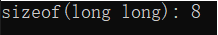
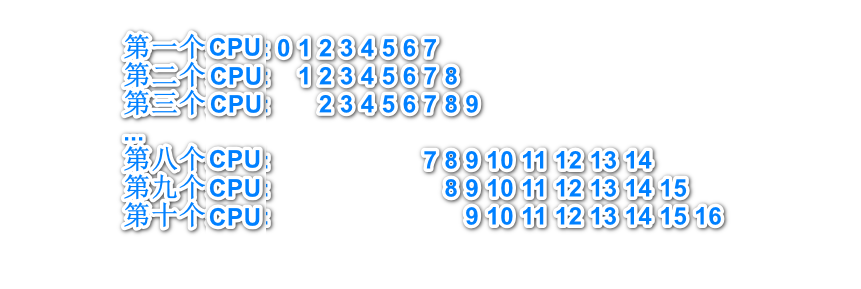
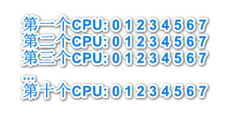
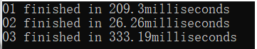
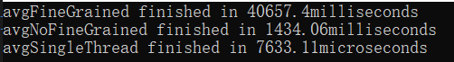

[toc]

# 0. 序言

> 多核CPU缓存Cache架构参考
>
> [CPU三级缓存技术解析 - 知乎 (zhihu.com)](https://zhuanlan.zhihu.com/p/461548456)
>
> 影响多线程速度的因素参考
>
> [c++ - Multithreading slows program: no False-sharing, no mutex, no cache misses, no small workload - Stack Overflow](https://stackoverflow.com/questions/52462481/multithreading-slows-program-no-false-sharing-no-mutex-no-cache-misses-no-sm)


# 1. 缓存行同步问题/共享数据竞争

由于CPU一次性读入的字节是**固定的, 不能再分割变小的**, 这个值被称为**机器字长**, 在64位机上, 它是64字节.

当**并行**时, **多个CPU可能会读入同一缓存行**, 每个CPU的数据是**相互独立**的, 每个CPU对缓存行的更改, 就会导致**数据在每个CPU内不一致**,

这时候就需要对数据**进行同步**，我的CPU是6核12线程i5


## 1.1 测试代码

1. 通用global.h::avgTime: 求函数执行时间的平均值

```c++
#pragma once
#include <chrono>
// 只支持一个参数(如果想要使用多个参数, 请用一个结构体将他们再封装一层)
template <typename Duration, typename Fn, typename Repeat, typename Args>
double avgTime(Fn& const fn, Repeat&& count, Args&& args) {
	using namespace std::chrono;

	high_resolution_clock::time_point t1 = high_resolution_clock::now();
	// repeat execute to make time avg and exact
	for (int i = 0; i < count; ++i) {
		fn(std::forward<Args>(args));  // 不是调用拷贝函数不应该用forward, 不过问题不大
	}
	high_resolution_clock::time_point t2 = high_resolution_clock::now();
	return duration_cast<Duration>(t2 - t1).count() / (double)count;
}
```

2. Synchronization.h

```c++
#include <thread>
#include <chrono>
#include <iostream>
#include <vector>
#include "global.h"

inline long long b[1024] = { 1 };
inline std::vector<std::thread> threads(10);

// 在数组指定索引位置累加
inline int SimpleTask(int ix) {
	for (int i = 0; i < 10e6; i++) {
		b[ix] += i;
	}
	return b[ix];
}

// 同步问题
inline void IfSynchronization(int elementSpace){
	for (int i = 0; i < threads.size(); ++i) {
		threads[i] = std::thread(SimpleTask, i * elementSpace);
	}
	for (int i = 0; i < threads.size(); ++i) {
		threads[i].join();
	}
}

inline void TestForSync() {

	using namespace std;
	typedef chrono::milliseconds ms;

	double time, time02, time03;
	
	// 导致缓存行同步
	time = avgTime<ms>(IfSynchronization, 100, 1);
	cout << "01 finished in " << time << "milliseconds\n";
	// 不导致缓存行同步
	time02 = avgTime<ms>(IfSynchronization, 100, 8);
	cout << "02 finished in " << time02 << "milliseconds\n";
	// 共享资源
	time03 = avgTime<ms>(IfSynchronization, 100, 0);
	cout << "03 finished in " << time03 << "milliseconds\n";
}
```


## 1.2 测试逻辑

其中先申请一个数组, **数组元素在内存中地址是连续的**

```c++
inline long long b[1024] = { 1 };
```

long long类型变量**长度为8字节**, 这就意味着CPU读入数据时, 一次性读入8个long long类型的元素



创建10个线程, 每个线程访问数组的一个位置

> IfSynchronization(1), 表示每个线程每隔一个位置访问数组
>
> IfSynchronization(8), 表示每个线程每隔八个位置访问数组
>
> IfSynchronization(0), 表示每个线程都访问数组索引0的位置


对于IfSynchronization(1)， 每个CPU缓存行对应的数组元素索引如下



可以看出, 第一个CPU修改数组索引0位置的元素时, 其它CPU内没有索引0的数据, 不需要进行同步. 但第八个CPU修改索引为**7**的元素时, CPU**1到7**都需要进行同步. 以免其它CPU将错误的数据覆盖写入到内存中.


对于IfSynchronization(8)， 每个CPU缓存行对应的数组元素索引如下


可以看出，每个CPU缓存行内的数据都是**独一无二**的, 因此不需要进行同步


对于IfSynchronization(0)， 每个CPU缓存行对应的数组元素索引如下



每个CPU对任何一个数据的修改都会使**其它全部CPU**数据进行同步. 

更糟的是, 对**共享数据**的并行操作, 会导致最后结果不可预测, 且是错的, 加锁能够实现代码串行化, 但会严重影响效率.


## 1.3 测试结果

测试时**不要**使用VisualStudio的Release发布模式, 它会帮你优化代码, 影响测试结果




## 1.4 小结

> 为了避免缓存行同步问题, 应该保证每个线程处理**连续一片**的数据
>
> 多个线程之间处理的数据**不要挨得太近**， 缓存行同步问题在线程任务颗粒度较大时少有发生


# 2. 任务颗粒度过小问题

操作系统新建和销毁线程是**需要时间花销**的，如果线程执行的任务**过于简单**，管理它的代价胜于它干的活加速的时间，那么将会得不偿失。


## 2.1 测试代码

```c++
#include <iostream>
#include <thread>
#include <chrono>
#include <vector>
#include "global.h"

// 6线程, 执行细颗粒度任务, 线程每次处理数组1000个元素
// 6线程, 执行非细颗粒度任务, 线程每次处理数组100e3的元素

inline size_t numEntities = 100e4;
inline size_t numThreads = 6;
inline std::vector<double> v;

inline void ThreadWork(int startIx, int endIx){
	// simple work. sum all value between startIx and endIx
	double sum = 0L;
	for (int i = startIx; i <= endIx; i++) {
		sum += v[i];
	}
}

inline void LaunchThread(size_t numPerThread) {
	int curIx = 0;
	while (curIx < numEntities) {
		std::vector<std::thread> threads;
		threads.reserve(numThreads);

		// per thread handle 'numPerThread' value at once
		for (int i = 0; i < numThreads; i++) {

			int endIx = (curIx + numPerThread - 1);
			std::thread t;

			// Cannot cross the index scope
			if (endIx >= numEntities) {
				endIx = numEntities - 1;

				t = std::thread(ThreadWork, curIx, endIx);
				threads.push_back(std::move(t));
				curIx += numPerThread;

				break;
			}

			t = std::thread(ThreadWork, curIx, endIx);
			threads.push_back(std::move(t));
			curIx += numPerThread;
		}

		for (int i = 0; i < threads.size(); i++) {
			threads[i].join();
		}
	}
}

inline void SingleThreadWork(std::vector<double>& v) {
	double sum = 0;
	for (int i = 0; i < v.size(); ++i) {
		sum += v[i];
	}
}

inline void TestForGrained(){

	using namespace std;
	typedef chrono::microseconds ms;

	for (int i=0; i< numEntities; ++i){
		v.push_back(i);
	}

	double avgFineGrained = 0, avgNoFineGrained = 0 , avgSingleThread = 0;

	// execute many time in order to imporve resolution.
	// fine-grained 细颗粒度线程(执行任务过于简单)
	avgFineGrained = avgTime<ms>(LaunchThread, 100, 1000);
	// less fine-grained 
	avgNoFineGrained = avgTime<ms>(LaunchThread, 100, 100e3);
	// single thread
	avgSingleThread = avgTime<ms>(SingleThreadWork, 100, v);

	cout << "avgFineGrained finished in " << avgFineGrained << "milliseconds\n";
	cout << "avgNoFineGrained finished in " << avgNoFineGrained << "milliseconds\n";
	cout << "avgSingleThread finished in " << avgSingleThread << "microseconds\n";

}
```


## 2.1 测试逻辑

**共需要执行100e4**加法运算, 三种执行方式

1. 细颗粒度多线程, 每个线程执行**1000次**加法
2. 非细颗粒度多线程，每个线程执行**100e3次**加法，只需要创建**10个子线程**即可
3. 单线程执行100e4次加法


## 2.2 测试结果




## 2.3 小结

> 线程并非越多越好, 因为管理新线程需要消耗CPU资源, 开辟多线程就像**老板请员工**, 不可能请太多的人, 每个人不可能只做一点点工作.为了充分**压榨CPU**的资源，应该开辟合适数量的多线程, 每个多线程做合适的工作. (CPU每秒执行约10e6次语句?)。另外，这里没有测试，但**多线程数量不应该超过cpu超线程数**. 使用**大颗粒任务**往往能避免缓存行同步问题。

