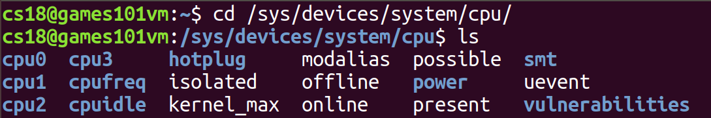
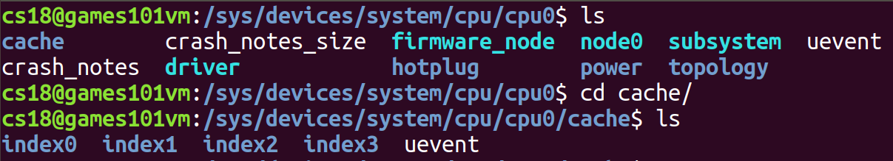
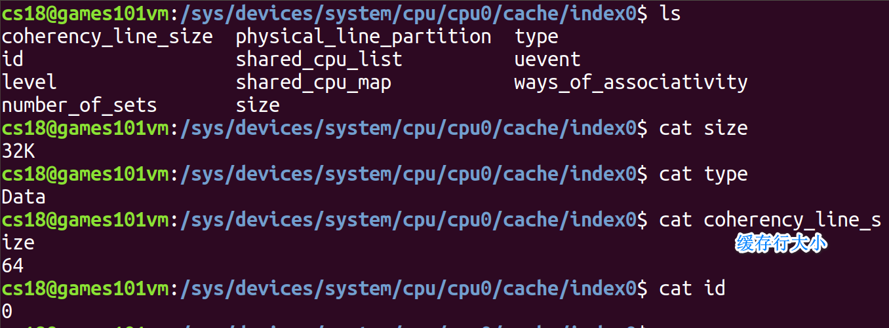
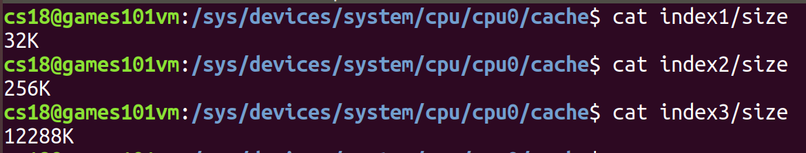
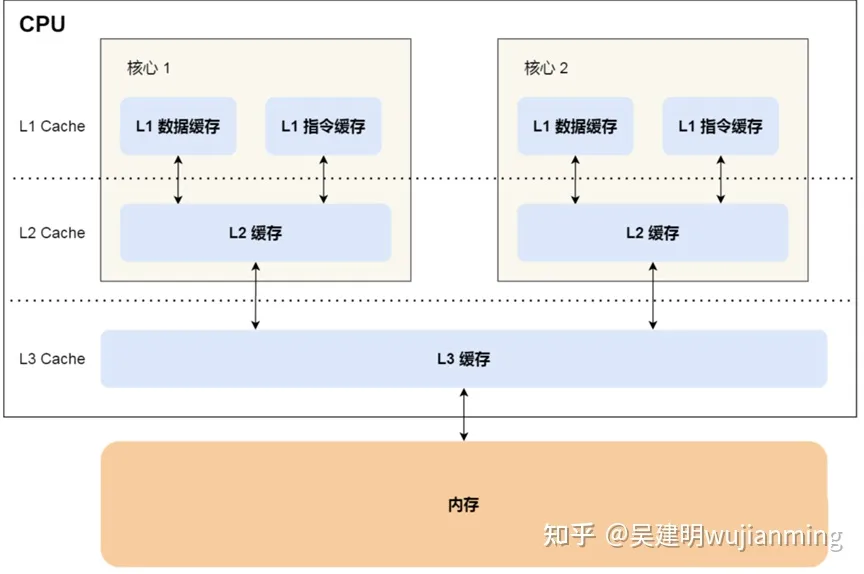
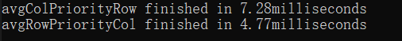
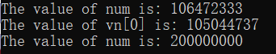

[toc]

# 3. 缓存未命中问题

计组课学习到主存和CPU速度仍然差很多，为了提高CPU利用率，而不是干等数据到来，在其中加入了**三级高速缓存**，高速缓存也叫Cache。有关**CPU缓存的属性, 在/sys/devices/system/cpu/**文件下, Linux就是这点好, 万物皆文件, 硬件也是文件, 查配置简单



因为虚拟机设置了2核4线程, 所以这里显示最多只有cpu3

**CPU缓存相关在./cpu/cpu[/d+]/cache**下



**index0是一级数据缓存, index1是一级指令缓存, index2是二级指令和数据缓存, index3是指令和数据缓存,** cache coherency缓存一致性



各级缓存大小



其中**index0, index1, index2每个CPU都有, index3所有CPU共享**




## 3.1 测试代码

```c++
#include <chrono>
#include <iostream>
#include <thread>
#include "global.h"

// 缓存行未命中 163840=10*1024*16 | 16
// 1级数据缓存 320 | 32K=1024*32B 8192
// 2及数据缓存 40 | 256K=1024*256 65536
#define ROW 320
#define COL 8192
#define REPEATCOUNT 100

inline int RowPriorityCol(int a[ROW][COL]) {
	int sum = 0;
	for (int i = 0; i < ROW; ++i) {
		for (int j = 0; j < COL; ++j) {
			sum += a[i][j];
		}
	}
	return sum;
}

inline int ColPriorityRow(int a[ROW][COL]) {
	int sum = 0;
	for (int j = 0; j < COL; ++j) {
		for (int i = 0; i < ROW; ++i) {
			sum += a[i][j];
		}
	}
	return sum;
}

inline void TestForCacheNoHit(){
	using namespace std;

	//int a[ROW][COL];
	int (*a)[COL] = new int[ROW][COL];
	double avgRowPriorityCol = 0, avgColPriorityRow = 0;

	for (int i = 0; i < ROW; i++) {
		for (int j = 0; j < COL; j++) {
			a[i][j] = i * j;
		}
	}

	avgRowPriorityCol = avgTime<chrono::milliseconds>(RowPriorityCol, REPEATCOUNT, a);
	avgColPriorityRow = avgTime<chrono::milliseconds>(ColPriorityRow, REPEATCOUNT, a);

	delete[] a;

	cout << "avgColPriorityRow finished in " << avgColPriorityRow << "milliseconds\n";
	cout << "avgRowPriorityCol finished in " << avgRowPriorityCol << "milliseconds\n";
}
```


## 3.2 测试逻辑

现在有两种遍历二维数组的方式: 一种是**行优先**, 另一种是**列优先**.

*行优先*

```c++
inline int RowPriorityCol(int a[ROW][COL]) {
	int sum = 0;
	for (int i = 0; i < ROW; ++i) {
		for (int j = 0; j < COL; ++j) {
			sum += a[i][j];
		}
	}
	return sum;
}
```

*列优先*

```c++
inline int ColPriorityRow(int a[ROW][COL]) {
	int sum = 0;
	for (int j = 0; j < COL; ++j) {
		for (int i = 0; i < ROW; ++i) {
			sum += a[i][j];
		}
	}
	return sum;
}
```

C语言中二维数组在内存里是以**一维的方式**存放的. 行优先每次访问数组元素的地址是**连续的**, 而列优先是离散的, **会跳过一行的元素**

现在只要让**每次跳过元素的总大小大于64B, 32KB或256KB**, 就能够模拟未击中缓存行, 未击中一级缓存和未击中二级缓存的场景. 三级缓存太大就不模拟了

例如一级缓存是32KB, 每个int类型是4B, **COL * 4 >= 32K = 1024 * 32B**, 解得COL => 8192, 所以只要每行有8192个元素, 隔行访问就能够一下跳过32KB的空间.


## 3.3 测试结果




## 3.4 小结

由于**程序的局部性效应**, CPU执行的**下一条指令很可能就在缓存**里. 通过**减少CPU访问主存的次数**来提高CPU执行效率. 所以, 尽可能让CPU读取的数据, 其内存地址跨度不要太大. 避免未命中缓存.

有关C语言数据在内存的存储方式以及C程序的内存结构可以参考

[第1篇:C/C++ 内存中的数据表示 - 知乎 (zhihu.com)](https://zhuanlan.zhihu.com/p/184860963)

[第5篇:C/C++ 内存布局与程序栈 - 知乎 (zhihu.com)](https://zhuanlan.zhihu.com/p/184957568)


# 4. mutex锁

当两个线程访问**临界资源**时, 由于执行顺序的不确定性, 会导致最后的结果不唯一, 并且是错误的. 常见的做法是加锁, 实现两个进程执行的串行化.


## 4.1 测试代码

```c++
#include <thread>
#include <iostream>
#include <vector>
#include <mutex>

inline int num = 0;
inline std::vector<int> vn(1);
inline std::mutex myMutex;

// num+=1不是原子操作
inline void OperateN() {
	for (int i = 0; i < 10e7; ++i) {
		num += 1;
	}
}

// vector也不带锁
inline void OperateVN() {
	for (int i = 0; i < 10e7; ++i) {
		vn[0] += 1;
	}
}

inline void OperateNLock() {
	std::lock_guard<std::mutex> guard(myMutex);
	for (int i = 0; i < 10e7; ++i) {
		num += 1;
	}
}

inline void TestForOperateN() {
	std::thread t01 = std::thread(OperateN);
	std::thread t02 = std::thread(OperateN);

	t01.join();
	t02.join();

	std::cout << "The value of num is: " << num << std::endl;

	vn[0] = 0;
	t01 = std::thread(OperateVN);
	t02 = std::thread(OperateVN);
	t01.join();
	t02.join();

	std::cout << "The value of vn[0] is: " << vn[0] << std::endl;

	num = 0;
	t01 = std::thread(OperateNLock);
	t02 = std::thread(OperateNLock);

	t01.join();
	t02.join();

	std::cout << "The value of num is: " << num << std::endl;
}
```

## 4.2 测试原理

有**两个**线程, 分别使变量sum自增**10e7**次, 那么正确的结果应该是**2 * 10e7**. 但看后面测试结果, 不加锁时, 计算的结果是错误的

通过加锁, A线程在执行num += 1语句时; B线程不能够执行, 也就是说**num += 1变为原子操作**. 但这样明显会有问题, 也就是AB不能同时执行了. 关于锁,操作系统原理笔记写起来, 刚好这个学期学.


## 4.3 测试结果



两个线程修改共享数据, 即使存在缓存行同步, 依旧导致最后的结果不正确. 

假设上面的线程为A,B. 要得出正确结果, 执行顺序应该为

​	***A 读 sum** -> A 执行 sum + 1 -> A 写入自增结果 -> B缓存行同步 -> **B 读 sum** -> B 执行 sum + 1 -> B写入自增结果 - > A缓存行同步*

而事实上可能发生

​	***A 读 sum -> B 读 sum** -> A 执行 sum + 1 ->  B 执行 sum + 1 -> A 写入自增结果 -> B缓存行同步 ->  B写入自增结果 - > A缓存行同步*

​	注意两种方式中, A和B读入sum值的位置, 后者对同一值的sum分别执行两次+1然后写入, 就相当于只执行一次+1.


## 4.4 小结

当两个线程访问临界资源时, 记得加锁. 当记住, 锁会影响多线程的执行效率. 因为当一个线程访问临界资源时, 另一个线程需要等待.


# 5. 总结

> 一开始对多线程理解不够, 总以为线程越多越快, 实际上线程只是交给操作系统的*计划单*. 真正执行还是CPU(可怜打工人). 一般程序就不要使用多线程了, 因为它较难理解. 还要注意**临界资源, 缓存行同步, 共享资源竞争, 任务颗粒度等**, . 但它适合计算量大的领域. 如图像处理,  我知道的两个渲染方法----光栅化和光线追踪, 处理每个屏幕像素的算法是一样且独立的(**意味着不需要考虑线程之间的通讯**), GPU就是因为**高并行**,所以适合做图像处理的(**也适合挖矿**).

